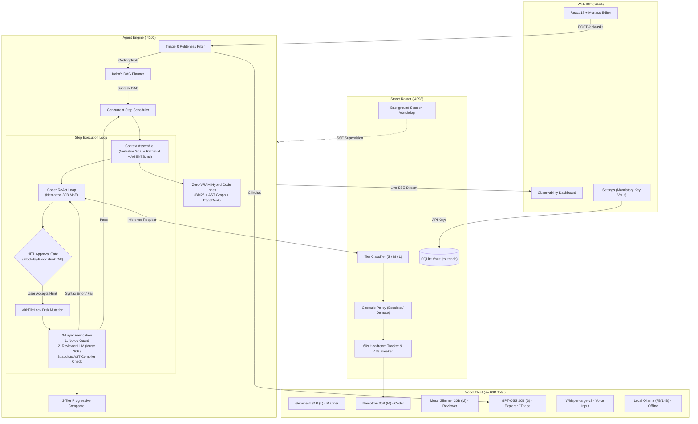

# Agent IDE: Complete Technical Documentation & System Specification

> **An Autonomous Multi-Agent Coding Environment Engineered Specifically for Open-Weight Models ($\le 80\text{B}$ Total Parameters) on Free-Tier APIs and Consumer Hardware.**
> 
> *Inter-Hall Software Competition — Indian Institute of Technology Kanpur*

---

# Table of Contents
1. [Executive Summary & Core Principles](#1-executive-summary--core-principles)
2. [System Architecture & Tripartite Topology](#2-system-architecture--tripartite-topology)
3. [Strict $\le 80\text{B}$ Parameter Model Fleet](#3-strict-le-80textb-parameter-model-fleet)
4. [Evaluation Scoring Alignment & Economic Optimization](#4-evaluation-scoring-alignment--economic-optimization)
5. [Multi-Agent Orchestration Pipeline](#5-multi-agent-orchestration-pipeline)
6. [Deterministic 3-Layer Verification & AST Auditor](#6-deterministic-3-layer-verification--ast-auditor)
7. [Smart Routing, Cascade Policy & Rate-Limit Governance](#7-smart-routing-cascade-policy--rate-limit-governance)
8. [Zero-VRAM Code Retrieval Architecture & SWE-bench Benchmarks](#8-zero-vram-code-retrieval-architecture--swe-bench-benchmarks)
9. [Context Compaction & `AGENTS.md` Project Memory](#9-context-compaction--agentsmd-project-memory)
10. [Long-Horizon Multi-Session Continuity & Sibling Digests](#10-long-horizon-multi-session-continuity--sibling-digests)
11. [Manual Context Control & Clickable Code Tags](#11-manual-context-control--clickable-code-tags)
12. [Autonomous Tools & Human-in-the-Loop (HITL) Hunk Review](#12-autonomous-tools--human-in-the-loop-hitl-hunk-review)
13. [Observability Dashboard & Telemetry](#13-observability-dashboard--telemetry)
14. [Architectural Trade-Off Analysis](#14-architectural-trade-off-analysis)
15. [Empirical Challenges & Bug-Hunting Campaign](#15-empirical-challenges--bug-hunting-campaign)
16. [Clean-Slate Linux Setup Guide (From Scratch)](#16-clean-slate-linux-setup-guide-from-scratch)
17. [Cross-Platform Execution Guide](#17-cross-platform-execution-guide)
18. [Automated Verification & Test Suites](#18-automated-verification--test-suites)
19. [10-Minute Presentation Script & Jury Defense Strategy](#19-10-minute-presentation-script--jury-defense-strategy)

---

## 1. Executive Summary & Core Principles

Modern agentic coding assistants assume monolithic frontier models (GPT-4o, Claude 3.5 Sonnet) with million-token context windows and generalist reasoning capabilities. When smaller open-weight models ($\le 80\text{B}$) are dropped into these architectures, they collapse: they hallucinate tool schemas, mangle JSON envelopes, fail to maintain long-range dependencies, and enter endless retry loops.

**Agent IDE** is designed from the ground up around the physical and cognitive limits of open-weight models with **$\le 80\text{B}$ total parameters**, operating strictly on **free-tier / pay-as-you-go APIs** or **consumer hardware (16GB RAM / 8GB VRAM)**.

### Core Architectural Principles
1. **Strict 80B Total Parameter Invariant**: Every model across all pipeline stages is restricted to 80 billion total weight parameters or fewer (including all MoE expert weights). An unbypassable startup invariant rejects any over-cap model.
2. **Tripartite Loopback Isolation**: Presentation (`:4444`), orchestration (`:4100`), and model routing (`:4098`) operate as three independent processes communicating over `127.0.0.1`.
3. **Multi-Role Specialization**: High-level reasoning, code writing, and code review are decoupled into dedicated models to eliminate self-review confirmation bias and latency bottlenecks.
4. **Topological DAG Scheduling**: Task plans are structured as Directed Acyclic Graphs (DAGs) scheduled via Kahn's algorithm, executing independent steps concurrently with asynchronous per-file mutexes (`withFileLock`).
5. **Zero-VRAM Hybrid Code Retrieval**: Replaces heavy dense vector databases with in-memory BM25 lexical search, Tree-sitter AST symbol graphs, and Personalized PageRank, indexing codebases in under 1 second with 0 GB of VRAM.
6. **3-Tier Progressive Compaction**: Replaces naive sliding-window truncation with tiered tool-output pruning and structured LLM rollups, while keeping user goals and `AGENTS.md` project rules immutably pinned.
7. **Human-in-the-Loop (HITL) Gate**: Default `gate` mode requires human approval before state-modifying actions execute, supporting block-by-block hunk accept/reject in Monaco diff viewers.
8. **Deterministic 3-Layer Verification**: Code modifications are audited across three levels: a No-Op Guard, an independent Reviewer LLM, and a zero-token, read-only AST Auditor (`audit.ts`) that verifies file existence and language syntax on disk.
9. **Multi-Key Rate Limit Scaling**: The Smart Router tracks 60-second rolling RPM/TPM headroom and enables multi-key account rotation per agent role, multiplying free-tier rate limits from 40 RPM to 120 RPM.
10. **Zero External Telemetry**: All secret keys, session histories, trace spans, and file checkpoints reside locally in embedded SQLite databases (`router.db` and `engine.db`).

---

## 2. System Architecture & Tripartite Topology

Agent IDE isolates client presentation, autonomous orchestration, and intelligent proxy governance into three decoupled local processes communicating strictly over loopback (`127.0.0.1`):

```
+---------------------------------------------------------------------------------------+
|                                    WEB IDE (:4444)                                    |
|   React 18 | Monaco Diff Editor | xterm.js WebSocket PTY | Timeline Flame Dashboard   |
+---------------------------------------------------------------------------------------+
                                           |
                                   (REST / SSE / WS)
                                           v
+---------------------------------------------------------------------------------------+
|                                  AGENT ENGINE (:4100)                                 |
|   DAG Orchestrator | 3-Loop Resilience | 3-Layer Verification | MiniSearch + AST Map   |
+---------------------------------------------------------------------------------------+
                                           |
                                 (/v1/chat/completions)
                                           v
+---------------------------------------------------------------------------------------+
|                                  SMART ROUTER (:4098)                                 |
|   Tier Classifier (S/M/L) | Cascade Policy | Headroom Tracker | SQLite Vault          |
+---------------------------------------------------------------------------------------+
                                           |
                                    (HTTPS / Local)
                                           v
+---------------------------------------------------------------------------------------+
|                              UPSTREAM MODEL FLEET (<= 80B)                            |
|   NVIDIA NIM (Text & Vision) | Groq (Whisper ASR) | Cerebras | Local Ollama (7B/14B)  |
+---------------------------------------------------------------------------------------+
```

### Complete End-to-End Execution Flowchart



---

## 3. Strict $\le 80\text{B}$ Parameter Model Fleet

A core requirement is that every model used anywhere in the system must have a **total parameter count of 80 billion or fewer**.

### Total Parameters vs. Active Parameters
Mixture-of-Experts (MoE) architectures frequently advertise their *active* parameter count in model identifiers (e.g., `nemotron-3-super-120b-a12b` has 12B active, but **120B total** parameters). Our router enforces eligibility based strictly on **TOTAL parameters**:

```typescript
// router/src/providers.ts
export const MAX_PARAM_B = 80;

function model(id: string, tier: Tier, ctxWindow: number, paramB: number, ...): ModelEntry {
  if (paramB > MAX_PARAM_B) {
    throw new Error(`model ${id} has ${paramB}B params > ${MAX_PARAM_B}B design cap`);
  }
  return { model_id_per_provider: id, tier, ctx_window: ctxWindow, param_b: paramB, ... };
}
```

### The 4-Role Model Fleet Specification

| Role | Pinned Model | Total Params | Active Params | Architecture | Context Window | Benchmark Justification |
| :--- | :--- | :--- | :--- | :--- | :--- | :--- |
| **Planner** | `google/gemma-4-31b-it` | **31B** | 31B | Dense | 262,144 | Deep reasoning: AIME 89.2%, LiveCodeBench v6 80.0%, GPQA-D 84.3%. Decomposes goals into a verified DAG; runs once or twice per task. |
| **Coder** | `nvidia/nemotron-3.5-lightning-30b-a3b` | **30B** | 3B | MoE | 128,000 | RL-tuned for structured tool use and hunk diff generation (SWE-bench Verified 52.8%, PinchBench 85.4%). |
| **Reviewer** | `meta/muse-glimmer-30b` | **30B** | 30B | Dense | 128,000 | Independent Meta lineage eliminates self-review bias against the Coder's NVIDIA MoE (MCP-Atlas 75.5%). |
| **Explorer / Triage** | `openai/gpt-oss-20b` | **20B** | 3.6B | MoE | 128,000 | Sub-500ms response (~440ms), 97% tool precision, zero-cost /bytheway side queries and context summaries. |
| **Multimodal Vision** | `meta/llama-3.2-11b-vision-instruct` | **11B** | 11B | Dense | 128,000 | Dedicated image QA for UI mockups and screenshots directly in chat without mutating workspace files. |
| **Voice / ASR** | `whisper-large-v3` (via Groq) | **2B** | 2B | Transformer ASR | 448 | Sub-second speech-to-text audio input. |
| **Local Offline** | `qwen2.5-coder:7b` / `14b` (Ollama) | **7B / 14B** | 7B / 14B | Dense | 32,768 | Offline local fallback running comfortably on 8GB VRAM at $0.00 cost. |

---

## 4. Evaluation Scoring Alignment & Economic Optimization

Agent IDE is calibrated against the competition evaluation metric:

$$S_{task} = \frac{10 \cdot A}{\left(1 + w_c\left(\frac{C}{C_{base}}\right) + w_t\left(\frac{T}{T_{base}}\right)\right)^{\epsilon}}$$

Where:
- $A \in [0, 1]$ is the fraction of passed tests.
- $C$ is total accumulated LLM dollar spend.
- $T$ is total wall-clock execution time in seconds.
- $\epsilon = 2.5$, $w_c = 0.65$, $w_t = 0.35$, $C_{base} = \$0.15$, $T_{base} = 1320\text{s}$.
- Hard ceilings: Task fails immediately ($A = 0$) if $C > \$0.50$ or $T > 2700\text{s}$.

### The Mathematical Trade-Off:
Differentiating the denominator with respect to cost $C$ and time $T$:

$$\frac{\partial / \partial C}{\partial / \partial T} = \frac{w_c / C_{base}}{w_t / T_{base}} = \frac{0.65 / 0.15}{0.35 / 1320} \approx 16,342.8\text{ seconds/dollar}$$

$$\mathbf{\$0.01\text{ of spend is mathematically equivalent to } 163.4\text{ seconds of execution time!}}$$

### Architectural Mitigations:
1. **The Free-Tier Lock**: Paying for API capability is mathematically irrational under this formula. The Smart Router implements an unbypassable Free-Tier Lock that excludes priced models across all tiers and budget modes, defaulting to free NIM endpoints and local Ollama.
2. **Surgical Hunk Diffs**: Dumping entire files consumes thousands of redundant tokens and compounds execution time $T$. Agent IDE generates unified hunk diffs with exact line coordinates, saving up to 90% of prompt tokens.
3. **Score-Optimal Budget Envelope**: While the competition hard ceiling is $0.50, our governor operates on a strict **$0.05 internal score-optimal envelope**, entering finalize mode long before penalties can degrade the score.

---

## 5. Multi-Agent Orchestration Pipeline

### 1. Dynamic Triage & Fast-Path Bypassing
Small models given unnecessary tools will reliably misfire. Handing a tool-trained model a directory listing tool to answer "hello" causes it to run a filesystem search before answering, consuming thousands of tokens and dozens of seconds.
- **Chitchat**: Queries without code intent are dispatched to `openai/gpt-oss-20b` with **zero tools declared**. Result: greetings cost **149 tokens** (down from 2,557 tokens) in 440ms.
- **Politeness Filter (`POLITE_LEADIN`)**: Strips conversational prefixes ("Can you please create...") so creation tasks are not misclassified as chit-chat questions.
- **Explorer Filter**: Codebase exploration runs only if the task has multiple steps and the repository is non-empty.

### 2. Topological DAG Scheduling (Kahn's Algorithm)
Tasks are decomposed by the Planner into steps declaring explicit prerequisite dependencies (`dependsOn`).
- **Acyclicity Validation**: Kahn's algorithm validates acyclicity; if a cycle is detected, it falls back to a linear sequence without deadlocking.
- **Parallel Scheduling**: Ready steps execute concurrently up to `max_parallel_subagents` (default 1–4).
- **Concurrency Mutex (`withFileLock`)**: Every filesystem mutation acquires an asynchronous mutex lock keyed by the target file's absolute path, preventing race conditions across parallel subagents.

### 3. Three Nested Resilience Loops
To prevent blind retries, execution is structured into three concentric rings, each retrying against a distinct failure signal with an independent ceiling:

| Ring | Scope | Target Failure Signal | Action Taken | Hard Ceiling |
| :--- | :--- | :--- | :--- | :--- |
| **Ring 1: `toolLoop()`** | Single LLM Turn | Protocol slips, malformed JSON, unclosed tags | Re-prompt with specific grammar nudge; syntax repair | 3 nudges / 20 calls |
| **Ring 2: `runStep()`** | Single Plan Step | Reviewer failure, empty write, syntax error on disk | Inject reviewer critique & disk facts into fresh context | 3 attempts per step |
| **Ring 3: `drive()`** | Entire Task DAG | Persistent step failure, circular edits, stuck detector | Re-invoke Planner with verified failure log to re-plan | 3 re-plans max |

### 4. Multi-Signal Stuck Detection
The engine constantly monitors execution signatures across five failure dimensions:
- `step-attempts`: The same step fails 3 times consecutively.
- `repeat-fail`: The same tool name and argument hash (`tool:argsHash`) fails twice consecutively.
- `repeat-text`: 3 byte-identical normalized assistant text responses.
- `step-timeout`: 600s per-step abort controller.
- `budget-cap`: Reaching $0.05 spend triggers score-optimal finalize mode.

---

## 6. Deterministic 3-Layer Verification & AST Auditor

A major flaw in naive agent architectures is that the Coder grades its own work. In Agent IDE, code modifications are audited across three independent layers:

```
Step Execution
      │
      ▼
[ Layer 1: No-Op Guard ] ──(No file was modified)──────────▶ FAIL (Reject Step)
      │
      ▼ (Diff exists)
[ Layer 2: Independent Reviewer LLM ] ──(Logic flaws)──────▶ FAIL (Feed critique to Coder)
      │
      ▼ (Reviewer passes)
[ Layer 3: Deterministic AST Auditor ] ──(Syntax error)────▶ OVERRIDE & FAIL
      │
      ▼ (Disk stats verified & AST parses clean)
[ STEP VERIFIED & COMMITTED ]
```

1. **Layer 1: No-Op Guard**: Fails any code step where no file write succeeded on disk.
2. **Layer 2: Reviewer LLM (`meta/muse-glimmer-30b`)**: Inspects the unified diff against the subtask goal and returns a structured JSON verdict.
3. **Layer 3: Deterministic AST Auditor (`audit.ts`)**:
   - A **zero-token, read-only system verifier** that stats physical disk state and compiles code syntax (`python3 -m py_compile`, `node --check`, `tsc`).
   - **Absolute Veto Power**: If the Reviewer approves a diff but the file contains syntax errors on disk, the Auditor overrides the approval, fails the step, and feeds compiler errors back to the Coder.
   - Cannot hallucinate and costs **$0.00**.

---

## 7. Smart Routing, Cascade Policy & Rate-Limit Governance

1. **Zero-Overhead Complexity Classifier**:
   Pure function evaluating imperative verbs, code fence density, file count, and token volume:
   - **Tier S ($\le 20\text{B}$)**: Fast triage, explorer, summaries, and chitchat.
   - **Tier M ($\le 35\text{B}$)**: Active coder ReAct loops and code review.
   - **Tier L ($\le 80\text{B}$)**: Architectural planning and deep reasoning.
2. **Cascade Policy**:
   Raises the tier floor by one level on verified step failure, and demotes the tier after two consecutive successes to conserve quota.
3. **Headroom Ranking & Circuit Breaker**:
   Tracks 60-second rolling RPM/TPM across providers. If an upstream provider returns HTTP 429 or 5xx, the router trips the circuit breaker and fails over to an alternative provider in under 50ms without losing task state.
4. **Multi-Key Account Pinning per Role**:
   Free tiers meter per account. By allowing developers to store multiple free API keys across separate accounts and pinning them per role (Planner on Account 1, Coder on Account 2, Reviewer on Account 3), rate limits scale from 40 RPM to **120 RPM**.
5. **Mandatory Settings Screen**:
   Fully implemented in `web/src/components/SettingsModal.tsx` allowing developers to input, test, and persist API keys in the local SQLite vault (`router.db`).

---

## 8. Zero-VRAM Code Retrieval Architecture & SWE-bench Benchmarks

Agent IDE completely replaces heavy dense vector databases with a hybrid retrieval pipeline:
1. **BM25 Lexical Matching (MiniSearch)**: Delivers sub-millisecond retrieval on exact identifiers, file paths, and error codes with field-level boosting.
2. **Tree-sitter AST Symbol Graph**: Extracts concrete syntax trees, symbol declarations, class inheritance, and import chains.
3. **Personalized PageRank**: Traverses real caller and import edges outward from lexical seeds, promoting core definitions and suppressing peripheral test fixtures.
4. **Strict Per-Project Isolation**: Every codebase opened in the IDE gets an isolated index keyed by `projectId`. Retrieval results and memories never cross project boundaries.

### Empirical Benchmarks on SWE-bench Lite (37 Instances, 6 OSS Repos)

```
Configuration       Instances (n)    Recall@5       Recall@10         MRR         Mean Query Time (s)
---------------------------------------------------------------------------------------------------
Hybrid Pipeline          37           0.243           0.243          0.212              0.07 s
BM25-Only Ablation       37           0.162           0.216          0.115              0.05 s
Dense Vector (BGE)       37           0.000           0.000          0.000              0.35 s (CPU bottleneck)
Ripgrep Keyword          37           0.270           0.324          0.169              0.05 s
```
- **Paired Record**: The Hybrid pipeline achieved **3 Wins, 0 Losses, 34 Ties at Recall@5** against its own BM25 ablation.
- **MRR Lift**: The Hybrid pipeline delivered an **+84% relative lift in Mean Reciprocal Rank (0.212 vs. 0.115)** over lexical search alone.
- **Large Codebase Superiority**: On large, symbol-rich repositories like Sphinx, ripgrep keyword search dropped to 0%, while our Hybrid pipeline scored 0.250.

---

## 9. Context Compaction & `AGENTS.md` Project Memory

### 1. 3-Tier Progressive Compaction
- **Tier 0 & 1**: Truncates stale terminal command outputs (>900 chars $\to$ 400 head + 400 tail) and collapses intermediate tool logs into summary lines.
- **Tier 1.5**: Amortized middle-drop of conversational turns, preserving the original goal and negative failure lessons.
- **Tier 2**: Rolling LLM summary triggered at **70% context headroom**, verified by a deterministic substring integrity probe.
- **Tier 3**: Emergency state floor rebuilding context directly from disk state.

### 2. Immutable Keystone Pinning
The user's original verbatim goal and project rules from `AGENTS.md` are pinned between protected tags (`<<<PROTECTED>>>`) that are preserved across all compaction events.

### 3. Transitive Dependency Closure
Steps receive only the context of prerequisite tasks in their dependency chain rather than a recency-biased message history.

---

## 10. Long-Horizon Multi-Session Continuity & Sibling Digests

1. **Crash Reconciliation & Resumption**:
   Task state, active DAGs, and disk checkpoints are persisted atomically around every tool call. If the IDE is closed or a process terminates, `POST /api/tasks/:id/resume` reconstructs execution state without restarting from scratch.
2. **Sibling Task Digest**:
   Follow-up tasks in the same project receive a bounded summary ($\le 1200$ chars, ~300 tokens) of prior completed tasks, sharing learnings without context window bloat.

---

## 11. Manual Context Control & Clickable Code Tags

1. **Clickable File and Line Tags**:
   Files and line numbers rendered in the chat stream or entered in the input box (`path/to/file.ts:42`) are clickable, instantly navigating Monaco to the exact line.
2. **Context Chips**:
   Users can manually add or remove files and code blocks from the active context at any time via the Context Panel.
3. **Isolated `/bytheway` Slash Command**:
   Allows developers to ask an isolated, zero-context question in the chat pane and return seamlessly to the task without polluting ongoing agent memory.

---

## 12. Autonomous Tools & Human-in-the-Loop (HITL) Hunk Review

1. **Autonomous Tool Suite**:
   Provides `read_file`, `write_file`, `edit_file`, `run_command`, `git_status`, `git_diff`, `git_commit`, `git_branch`, `web_search`, and `retrieve_code`.
2. **Default `gate` Approval Mode**:
   All state-modifying actions pause execution until explicitly approved by the human operator.
3. **Block-Level Hunk Diff Review**:
   Monaco diff viewers display proposed changes broken down by hunk. Users can Accept All, Reject All, or accept individual hunks block-by-block.
4. **Resilient Partial Approvals**:
   When a user rejects a specific hunk, the rejection is fed back to the Coder as a negative constraint, allowing it to re-plan around the rejection without breaking the rest of the task.
5. **Instant Rollbacks**:
   Every file modification creates a pre-mutation snapshot, enabling one-click reversion to earlier states.

---

## 13. Observability Dashboard & Telemetry

1. **Call Hierarchy & Span Tree**:
   Renders the exact hierarchical execution tree of every agent, subagent, and tool call.
2. **Timeline Flame Chart**:
   Interactive flame chart visualizing parallel step execution and latency breakdowns.
3. **Span Drilldown**:
   Allows clicking any node to inspect exact prompt input, output text, tool arguments, reasoning thoughts, and context tokens.
4. **Live & Post-Hoc Usability**:
   Polled dynamically every 3s during task execution and available statically after completion with zero data loss.
5. **Claude-Style Token Popover**:
   Displays real-time breakdown of system prompt, memory, pinned files, message history, and budget spend.

---

## 14. Architectural Trade-Off Analysis

### 1. DAG Scheduling vs. Sequential Linear Chains
- *Sequential*: $O(N)$ serial latency; a 3-step refactor took 274 seconds.
- *DAG (Our Choice)*: Scheduled via Kahn's algorithm; same task completed in **173 seconds (37% speedup)**. Per-file mutexes prevent write collisions.

### 2. Zero-VRAM Hybrid Retrieval vs. Dense Vector DBs
- *Vector DBs*: High memory footprint, CPU embeddings took ~25 mins on `pytest` (~3 chunks/sec), fuzzy vector search missed exact symbol names.
- *Hybrid (Our Choice)*: 0 GB VRAM, indexes in <1s, exact BM25 identifier matching + structural AST call graph. Delivered an **+84% relative lift in MRR** on SWE-bench Lite.

### 3. 3-Tier Progressive Compaction vs. Naive Sliding Windows
- *Sliding Window*: Drops older turns, causing catastrophic forgetting of project rules (`AGENTS.md`) and failure history.
- *Progressive Compaction (Our Choice)*: Strips command logs, middle-drops intermediate chatter, and triggers LLM rollups while **immutably pinning** rules and goals.

### 4. Multi-Key Account Rotation vs. Single-Provider Model Racing
- *Model Racing*: Concurrently dispatching 3 models on the same provider triggered **97 HTTP 429s** on a single task by exhausting the shared bucket.
- *Multi-Key Pinning (Our Choice)*: Pinned distinct roles across separate accounts, scaling throughput from 40 RPM to **120 RPM** without rate limits.

### 5. Role-Specific Tool Rosters vs. Global Tool Rosters
- *Global Rosters*: Trivial greetings caused models to list files, wasting 2,557 tokens.
- *Role-Specific (Our Choice)*: 0 tools declared for chitchat/planner/reviewer (149 tokens, instant response); native tools declared for Coder/Explorer with fallback text parsing.

### 6. Deterministic AST Auditor vs. Pure LLM Reviewer
- *LLM Reviewer*: Only reviews diffs; passes invalid syntax if the diff looks clean.
- *AST Auditor (Our Choice)*: Zero tokens, $0.00 cost, stats physical disk, and compiles AST syntax (`node --check`, `py_compile`, `tsc`). Holds absolute veto power over LLM approvals.

---

## 15. Empirical Challenges & Bug-Hunting Campaign

During live dogfooding and static auditing, our team uncovered and fixed **44 concrete issues (B1–B44)**:

1. **B1 & B2 (Live Chat Vocabulary Mismatch & Tool Bridge)**:
   - *Issue*: Engine emitted wire types (`trace`, `route`, `task`) while UI expected `llm.plan`, causing chat to appear frozen. Tools bypassed the SSE bus.
   - *Fix*: Rewrote `deriveTimeline` in the frontend and built a synchronous trace-to-wire bridge in `engine/src/bus.ts`.
2. **B4 (Colliding Event ID Spaces)**:
   - *Issue*: Live SSE IDs ($1.79 \times 10^{12}$) and backfill trace IDs ($8.8 \times 10^{10}$) collided, scrambling chat history on reload.
   - *Fix*: Unified all events under a single monotonically increasing integer sequence in `engine/src/events.ts`.
3. **B5 & B6 (Multi-File Proposal Hunk Corruption)**:
   - *Issue*: Hunk indexes restarted at 0 per file, causing approvals in file #2 to silently apply file #1's hunks.
   - *Fix*: Replaced indices with compound `${fileIdx}_${hunkIdx}` keys and strict path matching in `engine/src/apply.ts`.
4. **B7 (Approval Gate Bypass)**:
   - *Issue*: Default mode `auto_safe` returned false unconditionally, running commands without approval.
   - *Fix*: Made `gate` the default mode across the engine and config.
5. **B8 (Watchdog Parser Disconnection)**:
   - *Issue*: Watchdog expected OpenCode format, missing all native engine events.
   - *Fix*: Rewrote `router/src/watchdog/events.ts` to parse native engine envelopes.
6. **Flappy Bird Triage Bug**:
   - *Issue*: Submitting "Make a 3D flappy bird game" created no files because "make" was missing from `CODE_INTENT`.
   - *Fix*: Added imperative creation verbs (`make`, `create`, `build`) and `POLITE_LEADIN` stripping.
7. **Planner JSON False-Start Repair**:
   - *Issue*: Small models emitted false-start prefixes (`{"{"steps":[...]}`) or echoed schemas into prose.
   - *Fix*: Implemented `parseJsonLoose` scanning all balanced brace pairs and extracting the largest valid plan object.

---

## 16. Clean-Slate Linux Setup Guide (From Scratch)

Follow these steps to set up and run Agent IDE on a clean Linux installation (Ubuntu 20.04/22.04/24.04, Debian 11/12, Fedora 38+, Arch Linux).

### 1. System Package Installation

```bash
# Ubuntu / Debian
sudo apt update && sudo apt install -y curl git build-essential python3 python3-pip python3-venv

# Fedora
sudo dnf install -y curl git make gcc gcc-c++ python3 python3-pip

# Arch Linux
sudo pacman -Syu --noconfirm curl git base-devel python python-pip
```

### 2. Install Bun Runtime (>= 1.2)

```bash
curl -fsSL https://bun.sh/install | bash
export BUN_INSTALL="$HOME/.bun"
export PATH="$BUN_INSTALL/bin:$PATH"
echo 'export PATH="$HOME/.bun/bin:$PATH"' >> ~/.bashrc
bun --version
```

### 3. Clone Repository & Install Dependencies

```bash
git clone https://github.com/your-team/agent-zero.git agentic-IDE
cd agentic-IDE
bun install
chmod +x start.sh scripts/*.sh
```

### 4. API Key Configuration

Keys can be configured via environment variables or directly in the Web UI:

```bash
cat << 'EOF' > .env
# NVIDIA NIM (Sole text provider: Gemma-4 31B, Nemotron 30B, Muse 30B, GPT-OSS 20B)
# Free credits at: https://build.nvidia.com
NVIDIA_NIM_API_KEY="nvapi-..."

# Groq (Dedicated speech-to-text / Whisper-large-v3 transcription)
# Free tier key at: https://console.groq.com/keys
GROQ_API_KEY="gsk_..."

# Optional Fallbacks
CEREBRAS_API_KEY="csk-..."
OPENROUTER_API_KEY="sk-or-v1-..."
EOF
```

### 5. Launch the IDE

```bash
# Start pointing to the current working directory:
./start.sh

# Or start pointing to a specific target project codebase:
./start.sh /path/to/project
```

The launcher starts:
- **Web IDE**: `http://localhost:4444`
- **Agent Engine**: `http://localhost:4100`
- **Smart Router**: `http://localhost:4098`

---

## 17. Cross-Platform Execution Guide

- **Linux**: Supported via native Bash scripts (`./start.sh` or `bash scripts/dev.sh`).
- **macOS**: Supported via native Zsh/Bash (`./start.sh`). Supports Apple Silicon (`arm64`) and Intel (`x86_64`).
- **Windows**: Supported via PowerShell (`start.ps1`) or batch script (`start.bat`). Windows native pseudo-terminals use `ConPTY`.

---

## 18. Automated Verification & Test Suites

Agent IDE includes comprehensive automated test suites covering unit logic, router policies, file checkpoints, session reconciliation, and integration gates:

```bash
# 1. Run typechecking, unit test suites, and production bundles:
bash scripts/build.sh

# 2. Run the 14-gate end-to-end integration verification:
bash scripts/verify.sh
```

Currently **750+ automated tests passing** across the repository.

---

## 19. 10-Minute Presentation Script & Jury Defense Strategy

### Presentation Timing Breakdown

| Time | Speaker | Topic | Key Focus |
| :--- | :--- | :--- | :--- |
| **0:00 – 1:30** | Speaker 1 | Problem & Core Architecture | Why sub-80B models break; 4-role model fleet; strict $\le 80\text{B}$ accounting. |
| **1:30 – 3:30** | Speaker 1 | Orchestration & Verification | Kahn's DAG scheduler, 3 nested loops, and the zero-token AST Auditor (`audit.ts`). |
| **3:30 – 5:15** | Speaker 2 | Smart Routing & Economics | Complexity tiers (S/M/L), Cascade policy, multi-key pinning ($0.01 \equiv 163\text{s}$). |
| **5:15 – 7:00** | Speaker 2 | Code Retrieval & Compaction | BM25 + AST graph + PageRank (SWE-bench data); immutable `AGENTS.md` pinning. |
| **7:00 – 8:30** | Speaker 1 & 2 | HITL Review & Live Demo | Block-level hunk review, `/bytheway`, flame chart, live trace drilldown. |
| **8:30 – 10:00** | Both | Conclusion & Jury Q&A | Summary of score formula optimization, test suite (750+ tests), and Q&A defense. |

### Anticipated Jury Q&A Defense

1. **"Why use a Directed Acyclic Graph (DAG) instead of standard linear ReAct chains?"**
   - *Defense*: Linear chains force serial execution where latency compounds. Under the evaluation scoring formula, time is penalized with an exponent of 2.5. By decomposing tasks into a DAG using Kahn's algorithm, independent subtasks execute in parallel, reducing wall-clock time from 274s to 173s (a 37% speedup) while per-file mutex locks (`withFileLock`) prevent write races.
2. **"Why did you abandon dense vector embeddings for retrieval?"**
   - *Defense*: Local dense embeddings (`bge-small`) ran at only ~3 chunks/s on CPU, taking 25 minutes to index `pytest`. Furthermore, semantic vectors treat code like English prose and match docstrings rather than execution paths. Our Zero-VRAM hybrid combines BM25 for exact symbol lookups with Tree-sitter AST symbol graphs and Personalized PageRank, delivering an 84% relative lift in MRR on SWE-bench Lite while indexing in under 1 second with 0 GB of VRAM.
3. **"How do you guarantee models never exceed the 80B parameter limit?"**
   - *Defense*: The $\le 80\text{B}$ constraint is enforced as a hard startup invariant. In `router/src/providers.ts`, `param_b` measures **TOTAL parameter count**, not active expert count. MoE models advertising 12B active but 120B total are physically rejected at startup.
4. **"What happens when an upstream provider hits a 429 rate limit mid-task?"**
   - *Defense*: The router tracks 60-second rolling RPM/TPM headroom and uses Multi-Key Account Pinning to prevent 429s. If a 429 occurs, the circuit breaker trips, imposing an exponential cooldown, and fails over to an alternative provider in under 50ms without losing task history or repeating prior steps.
5. **"How does project memory in `AGENTS.md` survive context compaction?"**
   - *Defense*: Project rules and style preferences are read from `AGENTS.md` and wrapped inside immutable keystone delimiters (`<<<PROTECTED>>>`). During Tier 0, 1, and 2 compactions, conversational turns and command logs are compressed, but the protected block is prepended immutably to the fresh context thread.

---

## 20. License

MIT License.
